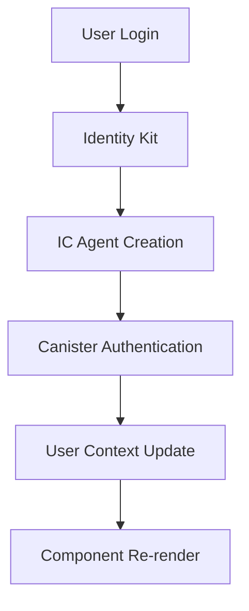
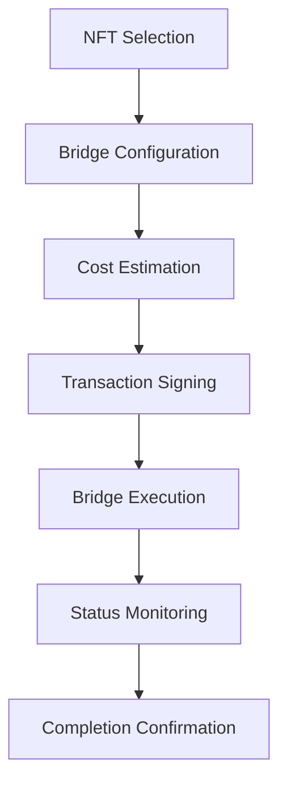
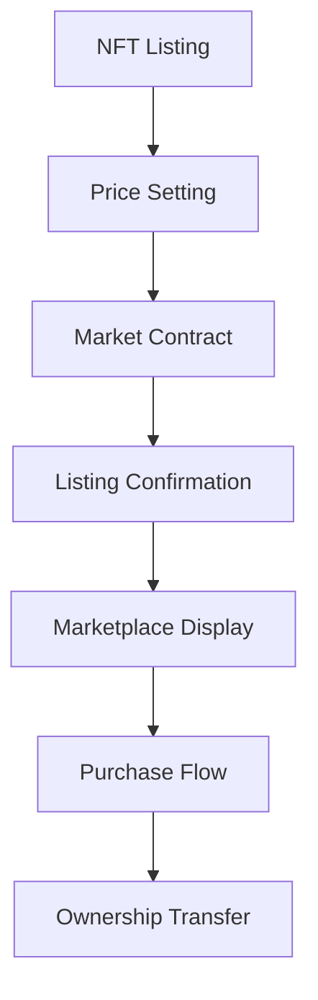

import { Meta } from '@storybook/blocks';

<Meta title="Documentation/Architecture" />

# 99React Architecture Overview

## System Architecture

99React is a comprehensive NFT bridge and marketplace application built with React, TypeScript, and the Internet Computer ecosystem. The architecture follows modern React patterns with a focus on modularity, type safety, and seamless cross-chain interactions.

## Core Technologies

### Frontend Stack
- **React 18** - Modern React with concurrent features
- **TypeScript** - Type safety and enhanced developer experience
- **Vite** - Fast build tool and development server
- **TailwindCSS** - Utility-first styling framework
- **React Query** - Server state management and caching
- **React Router** - Client-side routing

### Internet Computer Integration
- **Agent-JS** - IC agent for canister communication
- **ICRC-7/37** - NFT standard implementation
- **ICRC-99** - Cross-chain bridge standard
- **Identity Kit** - Authentication and identity management

### Cross-Chain Support
- **EVM Integration** - Ethereum Virtual Machine support
- **Solana Integration** - Solana blockchain support
- **Bridge Protocol** - ICRC-99 based cross-chain transfers

## Application Layers

### 1. Presentation Layer
```
src/components/
├── bridge/          # Cross-chain bridge components
├── nft/            # NFT display and management
├── market/         # Marketplace components
├── auth/           # Authentication components
└── ui/             # Reusable UI components
```

**Key Patterns:**
- Component composition over inheritance
- Prop drilling avoided through context providers
- Loading and error states for all async operations
- Responsive design with mobile-first approach

### 2. Business Logic Layer
```
src/hooks/
├── useAuth.ts           # Authentication logic
├── useNFT*.ts          # NFT operations
├── use99*.ts           # Bridge operations
├── useMarket*.ts       # Marketplace logic
└── useEVM.ts           # EVM integration
```

**Key Patterns:**
- Custom hooks for business logic encapsulation
- React Query for server state management
- Type-safe API contracts
- Error boundary integration

### 3. Data Layer
```
src/services/
├── agents/         # IC agent configurations
├── canisters/      # Canister interface definitions
└── providers/      # Context providers
```

**Key Patterns:**
- Centralized agent management
- Type-safe canister interfaces
- Provider composition for dependency injection

## Data Flow Architecture

### Authentication Flow


### NFT Bridge Flow


### Marketplace Flow


## Component Architecture Patterns

### Provider Chain Pattern
All components requiring IC integration use a standardized provider chain:

```typescript
<IdentityKitProvider authType={IdentityKitAuthType.ACCOUNTS}>
  <AgentProvider network="local">
    <QueryClientProvider client={queryClient}>
      <YourComponent />
    </QueryClientProvider>
  </AgentProvider>
</IdentityKitProvider>
```

### Hook Composition Pattern
Complex operations are built using hook composition:

```typescript
function useBridgeOperation() {
  const { isAuthenticated } = useAuth();
  const { data: supportedChains } = useICRC99Support();
  const bridgeMutation = use99Mutations();
  
  // Compose complex bridge logic
  return { ... };
}
```

### Error Handling Pattern
Consistent error handling across the application:

```typescript
function useErrorBoundaryIntegration() {
  const queryClient = useQueryClient();
  
  return {
    onError: (error) => {
      // Log error, show toast, reset queries
      console.error('Operation failed:', error);
      queryClient.invalidateQueries();
    }
  };
}
```

## State Management Strategy

### Server State (React Query)
- API responses and canister data
- Cross-chain bridge status
- NFT collection and metadata
- Market listings and transactions

### Client State (React Context)
- User authentication state
- UI preferences and settings
- Navigation and routing state
- Temporary form data

### Local State (useState/useReducer)
- Component-specific UI state
- Form inputs and validation
- Modal and drawer visibility
- Loading indicators

## Performance Considerations

### Code Splitting
- Route-based splitting for main sections
- Component-based splitting for heavy features
- Dynamic imports for non-critical functionality

### Caching Strategy
- React Query for server state caching
- Service worker for static asset caching
- LocalStorage for user preferences
- Session storage for temporary data

### Optimization Techniques
- React.memo for expensive components
- useMemo/useCallback for expensive calculations
- Virtual scrolling for large lists
- Image lazy loading and optimization

## Security Architecture

### Authentication Security
- Identity Kit integration with IC
- Secure principal management
- Session management and refresh
- Logout and cleanup procedures

### Transaction Security
- Multi-signature support where required
- Transaction validation and confirmation
- Error handling for failed operations
- User consent for all operations

### Data Protection
- Input sanitization and validation
- XSS prevention measures
- CSRF protection
- Secure storage of sensitive data

## Deployment Architecture

### Development Environment
- Local IC replica for testing
- Hot module replacement for fast iteration
- TypeScript compilation and checking
- ESLint and Prettier for code quality

### Production Environment
- Static site generation with Vite
- CDN distribution for global access
- Environment-specific configuration
- Monitoring and error tracking

## Testing Strategy

### Unit Testing
- React Testing Library for components
- Jest for utility functions
- Mock service workers for API testing
- Coverage reporting and thresholds

### Integration Testing
- Storybook for component integration
- Playwright for end-to-end testing
- Cross-chain bridge testing
- Performance regression testing

### Documentation Testing
- Storybook visual regression tests
- Component prop validation
- Hook behavior verification
- Error scenario coverage

## Future Architecture Considerations

### Scalability
- Micro-frontend architecture for large teams
- Module federation for independent deployments
- Progressive web app capabilities
- Offline functionality support

### Extensibility
- Plugin architecture for new chains
- Theming system for customization
- API abstraction for multiple backends
- Component library publication

### Monitoring
- Real-time error tracking
- Performance monitoring
- User analytics and insights
- Bridge operation metrics

---

This architecture overview provides a comprehensive understanding of how 99React is structured and how its various components interact to provide a seamless NFT bridge and marketplace experience.