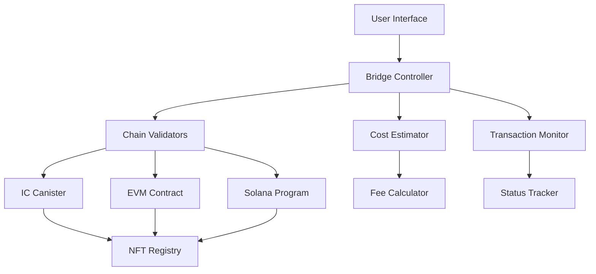

import { Meta } from '@storybook/blocks';

<Meta title="Documentation/Bridge Flow Documentation" />

# Bridge Flow Documentation

## Overview

The ICRC-99 bridge system enables seamless transfer of NFTs between different blockchain networks, including Internet Computer (IC), Ethereum Virtual Machine (EVM) compatible chains, and Solana. This document provides comprehensive documentation of the bridge flow, components, and integration patterns.

## Bridge Architecture

### Core Components



### Bridge Flow States

1. **Initialization** - Bridge setup and validation
2. **Cost Estimation** - Fee calculation and approval
3. **Asset Lock** - Source chain NFT locking
4. **Validation** - Cross-chain verification
5. **Minting** - Target chain NFT creation
6. **Completion** - Final confirmation and cleanup
7. **Error Recovery** - Failure handling and rollback

## Supported Bridge Routes

### IC ↔ EVM Chains
- **Ethereum Mainnet**
- **Polygon**
- **Binance Smart Chain**
- **Arbitrum**
- **Optimism**

### IC ↔ Solana
- **Solana Mainnet**
- **Solana Devnet** (testing)

### Future Support
- **Avalanche**
- **Fantom**
- **Near Protocol**
- **Cosmos Ecosystem**

## Bridge Flow Components

### 1. NFT Selection Step

**Purpose**: Allow users to select NFTs for bridge operation

**Component**: `NFTSelectionStep`

**Features**:
- Multi-NFT selection support
- Collection filtering and search
- Ownership verification
- Bridge compatibility checking

**Usage Example**:
```tsx
function EVMExportFlow() {
  const [selectedNFTs, setSelectedNFTs] = useState([]);

  return (
    <EVMExportWizard
      userNFTs={userOwnedNFTs}
      selectedNFTs={selectedNFTs}
      onSelectionChange={setSelectedNFTs}
      maxSelection={10}
      supportedCollections={bridgeSupportedCollections}
    />
  );
}
```

**Validation Rules**:
- NFT must be owned by user
- NFT collection must support bridging
- NFT must not be already in bridge process
- Maximum 10 NFTs per bridge operation

### 2. Chain Selection Step

**Purpose**: Select source and target blockchain networks

**Component**: `ChainSelectionStep`

**Features**:
- Supported chain listing
- Bridge route validation
- Network status checking
- Fee comparison between routes

**Usage Example**:
```tsx
function ChainSelector() {
  const { data: supportedChains } = useICRC99Support();
  const [route, setRoute] = useState(null);

  const handleRouteSelect = (sourceChain, targetChain) => {
    setRoute({ sourceChain, targetChain });
    // Validate route and estimate costs
  };

  return (
    <ChainSelectionStep
      supportedChains={supportedChains}
      selectedRoute={route}
      onRouteChange={handleRouteSelect}
    />
  );
}
```

### 3. Cost Estimation Step

**Purpose**: Calculate and display bridge operation costs

**Component**: `BurnCostStep`, `CanisterCostStep`, `ReturnCostStep`

**Features**:
- Real-time fee calculation
- Multiple fee components breakdown
- User balance checking
- Fee approval flow

**Cost Components**:
- **Bridge Fee** - Protocol fee for bridge operation
- **Network Fee** - Blockchain transaction fees
- **Processing Fee** - Canister computation costs
- **Validator Fee** - Multi-signature validation costs

**Usage Example**:
```tsx
function CostEstimation({ bridgeParams }) {
  const {
    data: costs,
    isLoading,
    error
  } = useBridgeCostEstimation(bridgeParams);

  const totalCost = costs?.reduce((sum, cost) => sum + cost.amount, 0);

  return (
    <BurnCostStep
      costs={costs}
      totalCost={totalCost}
      userBalance={userBalance}
      isLoading={isLoading}
      onApprove={handleCostApproval}
    />
  );
}
```

### 4. Remote Contract Step

**Purpose**: Configure target chain contract parameters

**Component**: `RemoteContractStep`

**Features**:
- Target contract validation
- Custom contract support
- Contract parameter configuration
- Security verification

**Usage Example**:
```tsx
function RemoteContractConfiguration() {
  const [contractAddress, setContractAddress] = useState('');
  const [isCustomContract, setIsCustomContract] = useState(false);

  return (
    <RemoteContractStep
      targetNetwork={selectedNetwork}
      contractAddress={contractAddress}
      onContractChange={setContractAddress}
      isCustomContract={isCustomContract}
      onCustomToggle={setIsCustomContract}
      onValidate={validateContract}
    />
  );
}
```

### 5. Transaction Execution Step

**Purpose**: Execute the bridge operation with progress tracking

**Component**: `BurnTransactionStep`

**Features**:
- Multi-step transaction execution
- Real-time progress tracking
- Error handling and recovery
- Transaction receipt generation

**Execution Phases**:
1. **Preparation** - Final validation and setup
2. **Source Lock** - Lock NFT on source chain
3. **Validation** - Multi-signature validation
4. **Target Mint** - Mint NFT on target chain
5. **Completion** - Finalize and cleanup

**Usage Example**:
```tsx
function BridgeExecution({ bridgeParams }) {
  const {
    executeBridge,
    progress,
    currentStep,
    isExecuting,
    error
  } = use99Mutations();

  const handleExecution = async () => {
    try {
      const result = await executeBridge(bridgeParams);
      onBridgeComplete(result);
    } catch (error) {
      handleBridgeError(error);
    }
  };

  return (
    <BurnTransactionStep
      progress={progress}
      currentStep={currentStep}
      isExecuting={isExecuting}
      error={error}
      onExecute={handleExecution}
      onRetry={handleExecution}
    />
  );
}
```

### 6. Bridge Status Monitoring

**Purpose**: Monitor bridge operation status and provide updates

**Component**: `BridgeStatusMonitor`

**Features**:
- Real-time status updates
- Transaction hash tracking
- Estimated completion time
- Success/failure notifications

**Status Types**:
- **Pending** - Operation initiated
- **Processing** - In progress
- **Validating** - Cross-chain validation
- **Completing** - Final steps
- **Completed** - Successfully finished
- **Failed** - Operation failed
- **Cancelled** - User cancelled

**Usage Example**:
```tsx
function BridgeMonitoring({ bridgeId }) {
  const {
    status,
    progress,
    estimatedCompletion,
    transactionHashes
  } = useBridgeStatus(bridgeId);

  return (
    <BridgeStatusMonitor
      status={status}
      progress={progress}
      estimatedCompletion={estimatedCompletion}
      transactionHashes={transactionHashes}
      onStatusChange={handleStatusUpdate}
    />
  );
}
```

## Bridge Operation Hooks

### use99Mutations Hook

**Purpose**: Primary hook for bridge operations

**Key Functions**:
- `initiateBridge()` - Start bridge operation
- `monitorBridge()` - Track bridge progress  
- `cancelBridge()` - Cancel pending operation
- `retryBridge()` - Retry failed operation

**Usage Pattern**:
```tsx
function BridgeController() {
  const {
    initiateBridge,
    monitorBridge,
    cancelBridge,
    retryBridge,
    isLoading,
    error,
    progress
  } = use99Mutations();

  const handleBridge = async (params) => {
    // Initiate bridge
    const bridgeId = await initiateBridge(params);
    
    // Monitor progress
    const unsubscribe = monitorBridge(bridgeId, {
      onProgress: updateProgress,
      onComplete: handleSuccess,
      onError: handleError
    });

    // Cleanup on unmount
    return unsubscribe;
  };

  return {
    handleBridge,
    cancelBridge,
    retryBridge,
    isLoading,
    error,
    progress
  };
}
```

### useICRC99Support Hook

**Purpose**: Check bridge support and capabilities

**Key Functions**:
- `getSupportedChains()` - List supported networks
- `checkTokenSupport()` - Verify token compatibility
- `getRouteInfo()` - Get route-specific information
- `validateBridgeParams()` - Validate bridge parameters

**Usage Pattern**:
```tsx
function BridgeConfiguration() {
  const {
    data: supportInfo,
    checkTokenSupport,
    validateRoute
  } = useICRC99Support();

  const handleTokenSelect = async (tokenId) => {
    const isSupported = await checkTokenSupport(tokenId);
    if (!isSupported) {
      showError('Token not supported for bridging');
      return;
    }
    // Continue with bridge setup
  };

  return (
    <BridgeSetup
      supportedChains={supportInfo?.chains}
      onTokenSelect={handleTokenSelect}
      onRouteValidate={validateRoute}
    />
  );
}
```

### useBridgeHistory Hook

**Purpose**: Manage user bridge operation history

**Key Functions**:
- `getBridgeHistory()` - Fetch user bridge history
- `getBridgeDetails()` - Get specific bridge details
- `retryFailedBridge()` - Retry failed operations

**Usage Pattern**:
```tsx
function BridgeHistory() {
  const { user } = useAuth();
  const {
    data: history,
    isLoading,
    refetch
  } = useBridgeHistory(user?.principal);

  const handleRetry = async (bridgeId) => {
    try {
      await retryFailedBridge(bridgeId);
      refetch();
    } catch (error) {
      showError(`Retry failed: ${error.message}`);
    }
  };

  return (
    <BridgeHistoryList
      history={history}
      isLoading={isLoading}
      onRetry={handleRetry}
      onRefresh={refetch}
    />
  );
}
```

## Bridge Wizard Implementation

### Multi-Step Wizard Pattern

**Complete Bridge Wizard**:
```tsx
function EVMExportFlow() {
  const [currentStep, setCurrentStep] = useState(0);
  const [bridgeData, setBridgeData] = useState({});

  const steps = [
    {
      id: 'nft-selection',
      component: ICNFTSelectionStep,
      title: 'Select NFTs',
      description: 'Choose NFTs to bridge'
    },
    {
      id: 'remote-contract',
      component: RemoteContractStep,
      title: 'Configure Contract',
      description: 'Set up remote contract details'
    },
    {
      id: 'cost-estimation',
      component: BurnCostStep,
      title: 'Review Costs',
      description: 'Review and approve bridge costs'
    },
    {
      id: 'remote-contract',
      component: RemoteContractStep,
      title: 'Configure Contract',
      description: 'Set target contract parameters'
    },
    {
      id: 'execution',
      component: BurnTransactionStep,
      title: 'Execute Bridge',
      description: 'Execute the bridge operation'
    }
  ];

  const handleStepComplete = (stepData) => {
    setBridgeData(prev => ({ ...prev, ...stepData }));
    setCurrentStep(prev => prev + 1);
  };

  const handleStepBack = () => {
    setCurrentStep(prev => Math.max(0, prev - 1));
  };

  const CurrentStepComponent = steps[currentStep]?.component;

  return (
    <Card className="max-w-4xl mx-auto">
      <Card.Header>
        <BridgeProgress
          steps={steps}
          currentStep={currentStep}
        />
      </Card.Header>
      
      <Card.Body>
        {CurrentStepComponent && (
          <CurrentStepComponent
            data={bridgeData}
            onComplete={handleStepComplete}
            onBack={handleStepBack}
            canGoBack={currentStep > 0}
          />
        )}
      </Card.Body>
    </Card>
  );
}
```

### Error Handling and Recovery

**Error Types**:
- **Validation Errors** - Invalid parameters
- **Network Errors** - Connectivity issues
- **Transaction Errors** - Blockchain transaction failures
- **Bridge Errors** - Protocol-specific failures
- **User Errors** - Insufficient balance, cancelled operations

**Recovery Strategies**:
```tsx
function BridgeErrorHandler({ error, onRetry, onCancel }) {
  const getErrorActions = (error) => {
    switch (error.type) {
      case 'INSUFFICIENT_BALANCE':
        return [
          { label: 'Add Funds', action: () => router.push('/wallet') },
          { label: 'Cancel', action: onCancel }
        ];
      
      case 'NETWORK_ERROR':
        return [
          { label: 'Retry', action: onRetry },
          { label: 'Cancel', action: onCancel }
        ];
      
      case 'VALIDATION_ERROR':
        return [
          { label: 'Go Back', action: () => history.back() },
          { label: 'Cancel', action: onCancel }
        ];
      
      default:
        return [
          { label: 'Contact Support', action: openSupport },
          { label: 'Cancel', action: onCancel }
        ];
    }
  };

  const actions = getErrorActions(error);

  return (
    <ErrorCard
      title="Bridge Operation Failed"
      message={error.message}
      actions={actions}
      severity={error.severity}
    />
  );
}
```

## Testing Bridge Flows

### Unit Testing Components
```tsx
import { render, screen, fireEvent } from '@testing-library/react';
import { EVMExportWizard } from './EVMExportWizard';
import { TestProviders } from '../test-utils';

describe('EVMExportWizard', () => {
  test('completes full export flow', async () => {
    render(
      <TestProviders>
        <EVMExportWizard />
      </TestProviders>
    );

    // Test NFT selection
    const nftCard = screen.getByTestId('nft-card-1');
    fireEvent.click(nftCard);
    
    const nextButton = screen.getByText('Next');
    fireEvent.click(nextButton);

    // Test chain selection
    const ethChain = screen.getByText('Ethereum');
    fireEvent.click(ethChain);
    
    fireEvent.click(nextButton);

    // Continue through all steps...
    
    // Verify completion
    await waitFor(() => {
      expect(screen.getByText('Bridge Complete')).toBeInTheDocument();
    });
  });

  test('handles errors gracefully', async () => {
    // Mock error scenario
    jest.spyOn(api, 'exportNFT').mockRejectedValue(new Error('Network error'));

    render(
      <TestProviders>
        <EVMExportWizard />
      </TestProviders>
    );

    // Complete steps and trigger error
    // ...

    await waitFor(() => {
      expect(screen.getByText('Bridge Operation Failed')).toBeInTheDocument();
    });
  });
});
```

### Integration Testing
```tsx
import { test, expect } from '@playwright/test';

test('complete bridge flow', async ({ page }) => {
  await page.goto('/bridge');

  // Select NFT
  await page.click('[data-testid="nft-card-1"]');
  await page.click('text=Next');

  // Select chains
  await page.click('text=Ethereum');
  await page.click('text=Internet Computer');
  await page.click('text=Next');

  // Approve costs
  await page.click('text=Approve');
  await page.click('text=Next');

  // Execute bridge
  await page.click('text=Execute Bridge');

  // Wait for completion
  await expect(page.locator('text=Bridge Complete')).toBeVisible();
});
```

## Performance Optimizations

### Lazy Loading
```tsx
const EVMExportWizard = lazy(() => import('./EVMExportWizard'));
const BurnTransactionStep = lazy(() => import('./BurnTransactionStep'));

function BridgePage() {
  return (
    <Suspense fallback={<div className="py-8 text-center text-gray-500 animate-pulse">Loading bridge...</div>}>
      <EVMExportWizard />
    </Suspense>
  );
}
```

### Caching Strategies
```tsx
// Cache bridge support data
const supportDataQuery = useQuery({
  queryKey: ['bridge-support'],
  queryFn: fetchBridgeSupport,
  staleTime: 5 * 60 * 1000, // 5 minutes
  cacheTime: 30 * 60 * 1000  // 30 minutes
});

// Cache cost estimations
const costEstimateQuery = useQuery({
  queryKey: ['bridge-cost', bridgeParams],
  queryFn: () => estimateBridgeCost(bridgeParams),
  enabled: !!bridgeParams,
  staleTime: 30 * 1000 // 30 seconds
});
```

## Security Considerations

### Validation
- All bridge parameters validated client and server-side
- NFT ownership verified before operations
- User balance checked before fee deduction
- Contract addresses validated against whitelist

### User Protection
- Clear cost breakdown and approval flow
- Confirmation dialogs for irreversible operations
- Operation history and receipt generation
- Timeout protection for long operations

### Error Prevention
- Comprehensive pre-flight checks
- Real-time balance monitoring
- Network connectivity validation
- Contract compatibility verification

---

This bridge flow documentation provides comprehensive guidance for implementing, using, and maintaining the ICRC-99 bridge system within the 99React application.